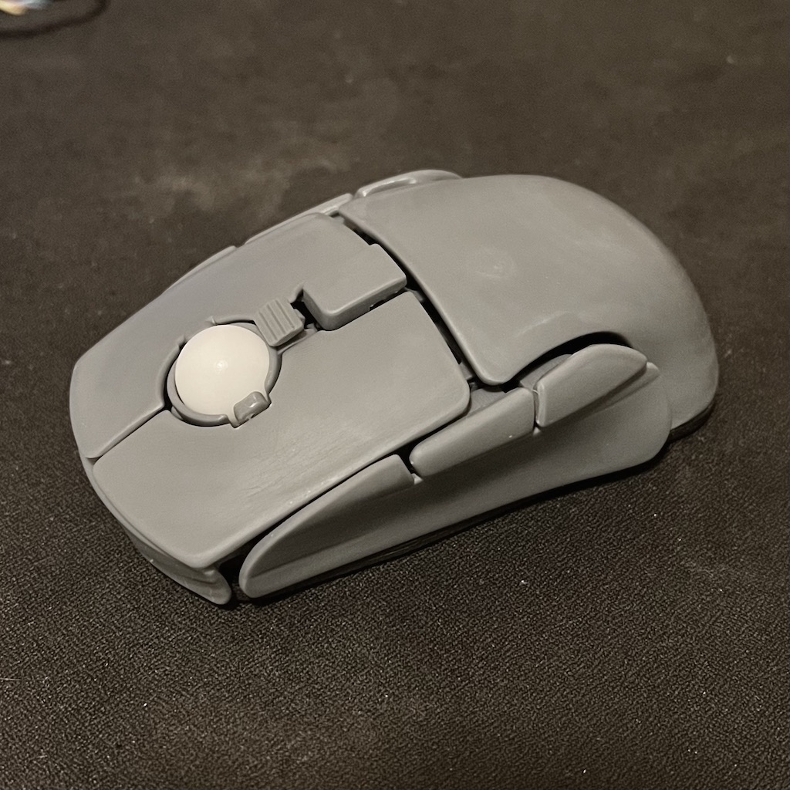
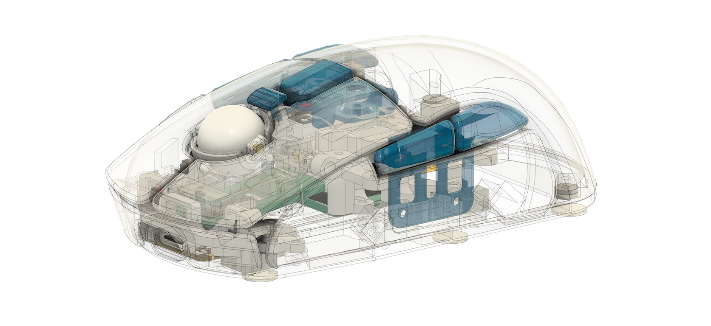
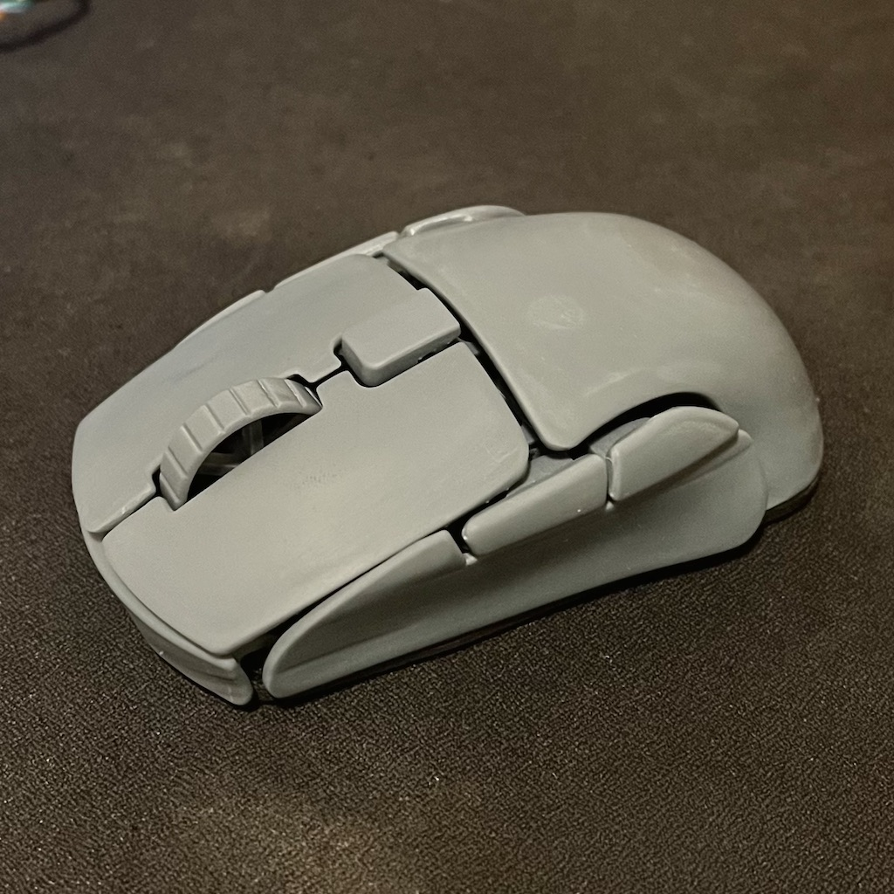
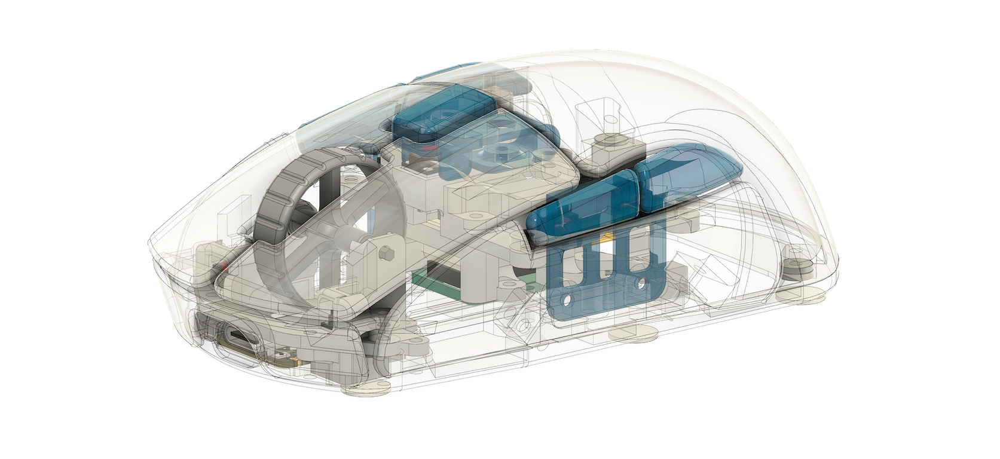

# ZMK Config for leylabella

This is the ZMK firmware config repository for [leylabella](https://github.com/badjeff/leylabella), a computer mouse 🐭.

Including 2 variant shield.
- `leylabella_m1`: For trackball for scrolling
- `leylabella_m2`: For scroll wheel

 
 

*Shield `leylabella_m1` with 15mm trackball

 

*Shield `leylabella_m2` with 23mm scroll wheel

## License

Available under the [MIT](/LICENSE) license.
